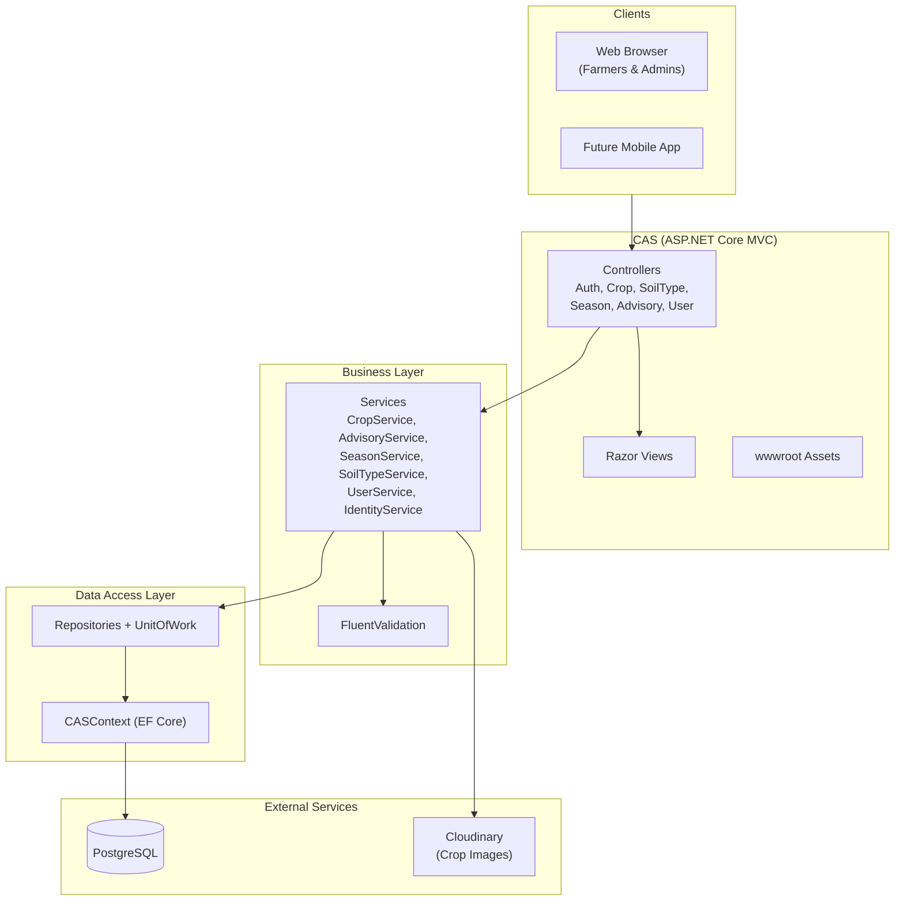
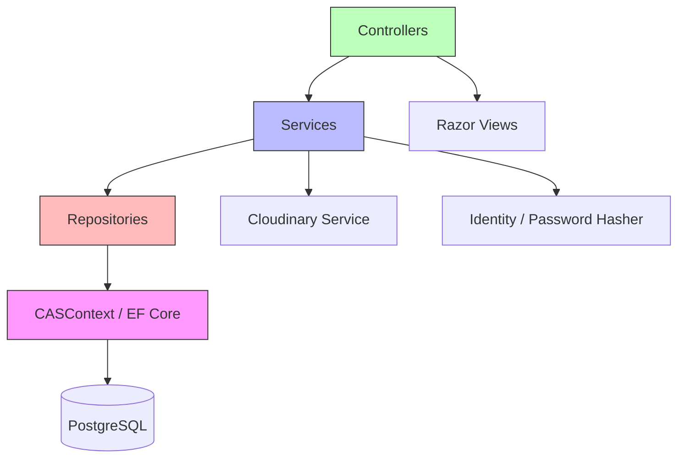
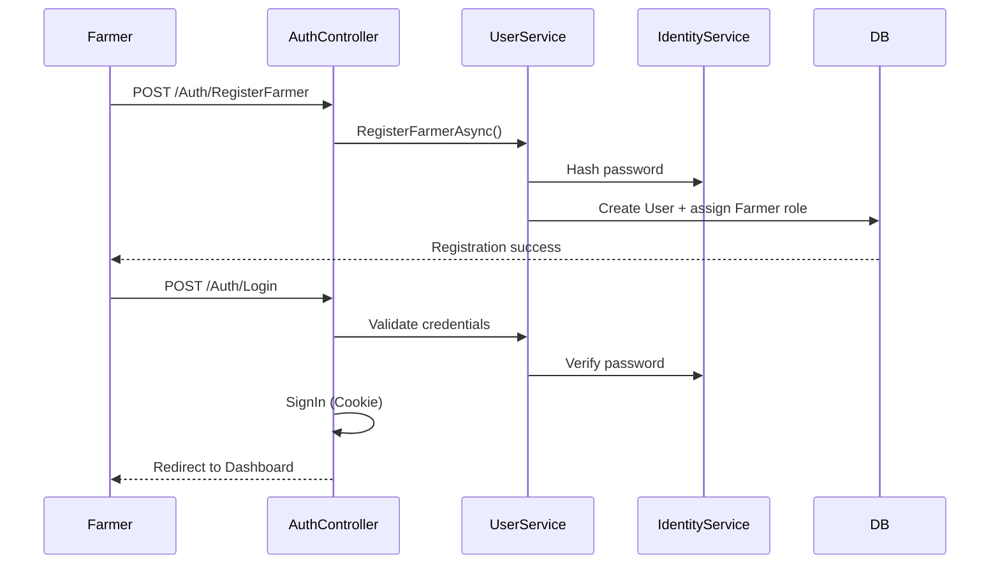
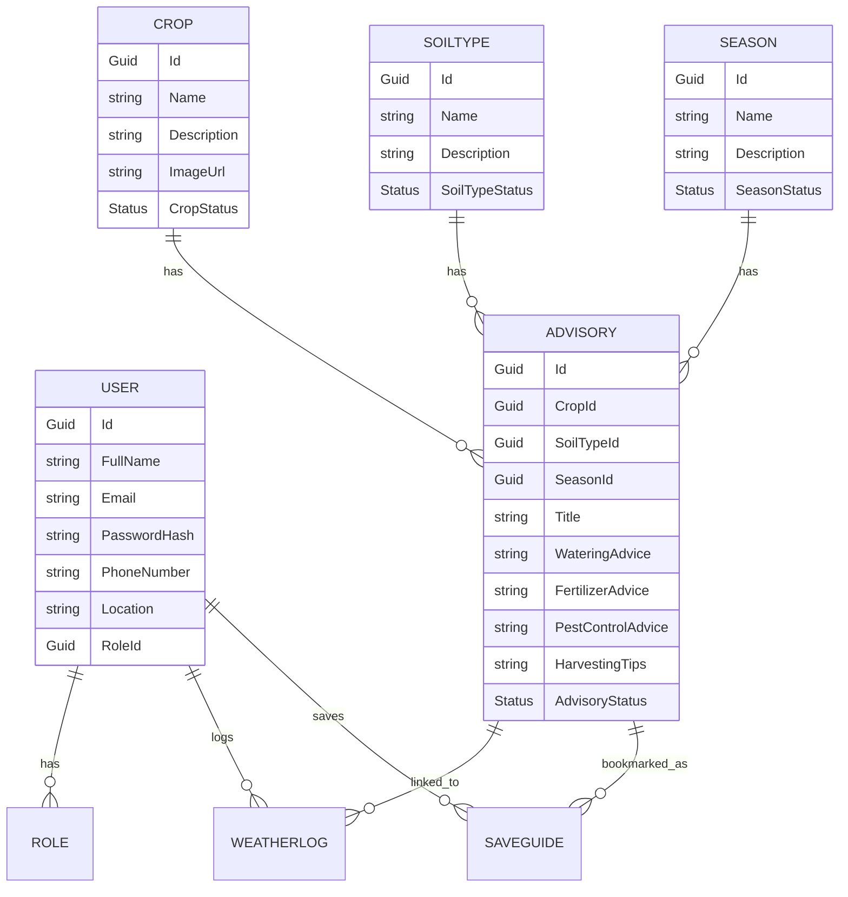
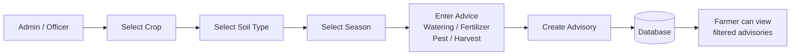
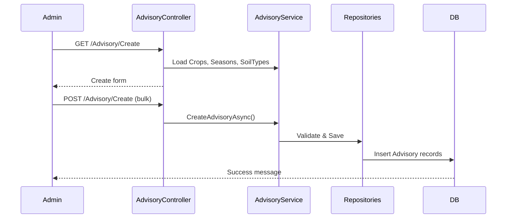
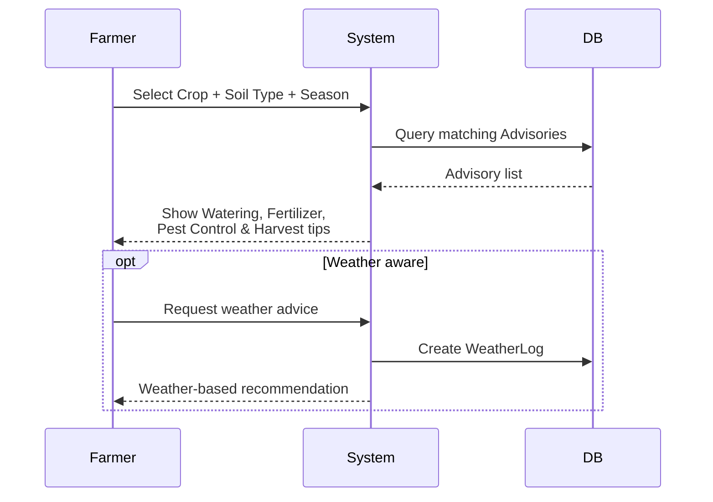
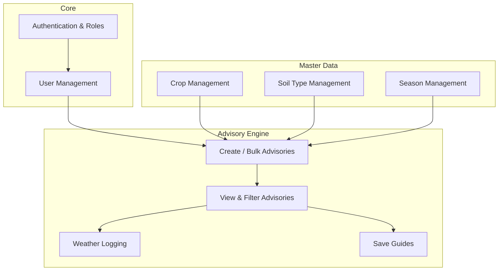
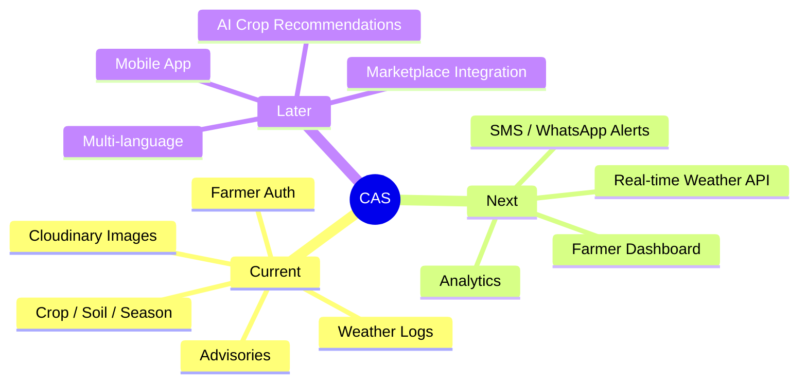

# Crop Advisory System (CAS) – Architecture & System Diagrams

This document contains the system architecture and key flow diagrams for the Crop Advisory System.

---

## 1. High-Level Architecture

---

## 2. Layered Architecture

---

## 3. Authentication Flow

---

## 4. Core Domain Entity Relationships

---

## 5. Advisory Creation Flow

### Advisory Sequence

---

## 6. Farmer Advisory Lookup Flow

---

## 7. Module Overview

---

## 8. Future Enhancements

---

**Notes**

- Diagrams are written in Mermaid and render on GitHub, GitLab, Notion, and VS Code.
- Update this file as new features are added.
